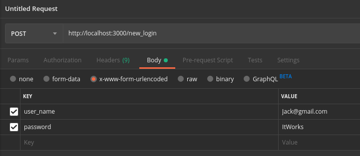

## Install Dependencies

Run the ```yarn``` command, if you do not have it installed you can follow the guide here: https://yarnpkg.com/en/docs/install#debian-stable.

## Run the server

To run the backend you should first make sure that MongoDB is running in the background, to run it the command is (on linux, if someone could update with windows and MacOSX ways):

```sudo mongod```

To run the server use the command:

```yarn run start```


### Working with the demo.
 
- Run the server using the command above.
- Open the index.html file inside the login_screen folder with your favorite web-browser, the shortcut is usually Ctrl-O.
- Make sure that you have added the user you are trying to sign in with to the database.
  - To do this first download and install Postman: https://www.getpostman.com/
  - Then send a post request to the new_login URL endpoint with a user_name and password field corresponding to the new user. This will look like this:
  
  .
  
  - Send that request and you should receive a message back with an id and the same user_name and password fields.

### Issues I commonly have.

#### Port Busy error for Mongo.

When the port is busy for starting up MongoDB this usually means you already have Mongo running and therefore don't have to worry about starting it again.

#### Nothing happens when I login.

The server might not be running or the server may have crashed. Go to where you started the server and make sure it didn't error out. If it did... :,(.

#### CORs problem in the console.

This is also usually caused by the server not running and therefore not sending a request back, usually starting the server up will fix this problem.


